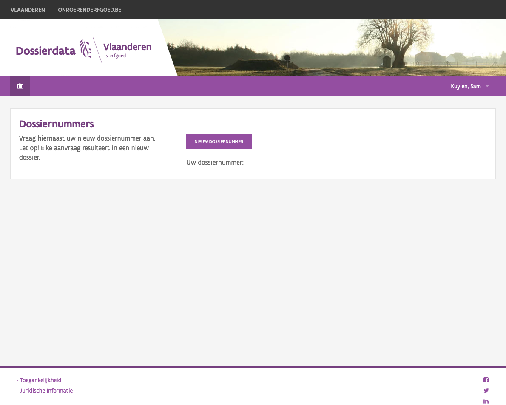

---?color=linear-gradient(110deg, #7B5394 50%, #F5F5F5 50%)
@title[Introductie]

<!--
Tip! Get started with this template as follows:
Step 1. Delete the contents of this PITCHME.md file.
Step 2. Start adding your own custom slide content.
Step 3. Copy slide markdown snippets from template/md directory as needed.
-->

@snap[west text-bold]
### Agentschap Onroerend Erfgoed
Vlaanderen is erfgoed
@snapend

@snap[south-west byline text-04 text-dark]
Presentatie Leersessie development pipeline & deployment tussen OVAM VMM VLM aOE dOMG
@snapend

---
@title[Voorbeeld applicatie Dossierdata]

@snap[north span 40]
#### Deploy applicatie dossierdata
@snapend

@snap[midpoint span-40]

@snapend

@snap[south-west span-30 text-06 fragment]
@box[rounded text-white box-overzicht](Stap 1.#Lege server via dOMG.)
@snapend

@snap[south span-30 text-06 fragment]
@box[rounded text-white box-overzicht](Stap 2.#Voorbereidingen via Ansible.)
@snapend

@snap[south-east span-30 text-06 fragment]
@box[rounded text-white box-overzicht](Stap 3.#Deploy door Fabric.)
@snapend

---
@title[Demo Ansible]

### Demo Ansible

---

@title[Demo Fabric]

### Demo Fabric

---
@title[Toekomstvisie]

### Toekomstvisie
+++?image=template/img/bg/purple.jpg&position=right&size=50% 100% 
@title[Toekomstvisie - Auto Deployment]

@snap[east text-white span-45]
@ol[split-screen-list text-08](false)
- Koppelen Ansible en Fabric-deploy
- Automatische deploy na release versie GitHub in Dev
- Duis aute irure dolor in reprehenderit in voluptate
@olend
@snapend

@snap[west]
@img[split-screen-img span-55](template/img/developer.jpg)
@snapend
